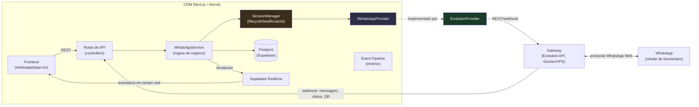
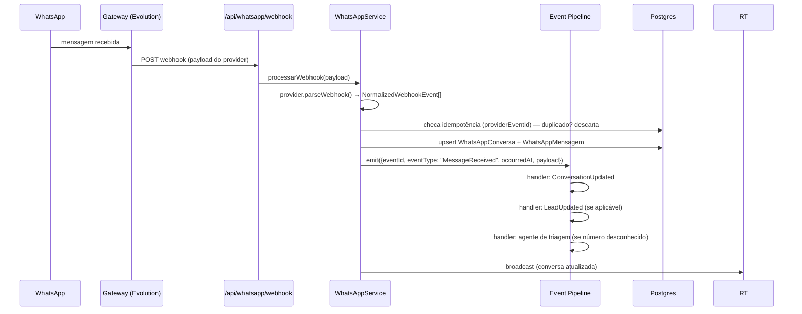
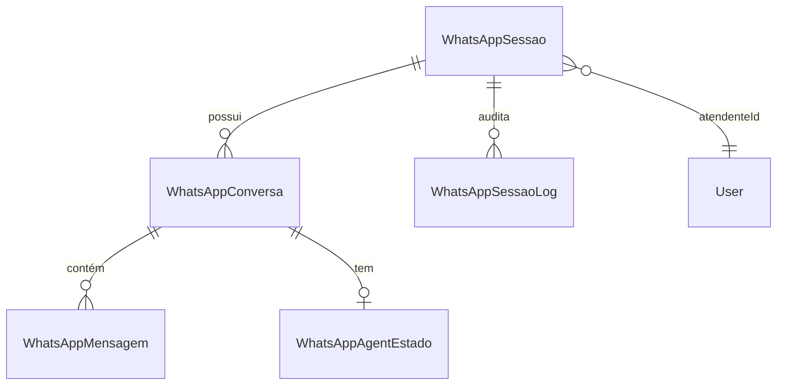

# Arquitetura do módulo WhatsApp

> Documento vivo — atualizar a cada fase implementada (ver plano de fases no final). Última atualização: **Fase 2 implementada** (Fase 1 — fundação — já estava pronta: schema, `IWhatsAppProvider`/`EvolutionProvider`, `SessionManager`, `WhatsAppService`, pipeline de eventos, RBAC restrito a Desenvolvedor, código Meta removido). Fase 2 adicionou: rotas de ciclo de vida completas (`qrcode`, `desconectar`, `reiniciar`, `logs`), broadcast efêmero via Supabase Realtime (QR ao vivo e mudança de status sem polling, ver `src/lib/whatsapp/realtime.ts`), e a UI de gerenciamento (fluxo de QR no modal de criação, health badge, ações de reconectar/desconectar, aba de histórico de auditoria por sessão). Validado localmente: typecheck/lint/build limpos, fluxo completo testado ponta a ponta contra uma sessão real no banco (falha de provider → transição de estado → `lastError` → log de auditoria, tudo sem quebrar a resposta). A criação de sessão real (handshake com o gateway) só funciona quando a VPS existir (Fase 5). Duas rodadas de revisão arquitetural antes da implementação trouxeram uma lista maior de refinamentos (ConnectionManager separado, DI registry, circuit breaker, storage adapter plugável, métricas, reestrutura DDD em `src/modules/`, entre outros) — deliberadamente **não** incorporados: nesta escala (um provider, um punhado de sessões, zero tráfego em produção ainda), o custo de manter essas camadas supera o benefício. Ver [Fora de escopo (arquitetura)](#fora-de-escopo-arquitetura) pra lista completa com o motivo de cada corte.

## Visão geral

O CRM se conecta ao WhatsApp de cada funcionário através de um **gateway self-hosted** compatível com o protocolo do WhatsApp Web (inicialmente [Evolution API](https://github.com/EvolutionAPI/evolution-api)), autenticado por QR Code, hospedado em VPS/Docker. Nenhum número é migrado para a API oficial da Meta — cada funcionário continua usando o próprio WhatsApp normalmente, com todo o histórico, mídias e contatos intactos no aparelho. O CRM apenas *observa e participa* da conversa através da sessão conectada.

Toda comunicação entre o CRM e o gateway passa por uma camada de abstração (`IWhatsAppProvider`), para que trocar de gateway no futuro (WPPConnect, Green API, ou até a API oficial da Meta) exija escrever um novo arquivo, não reescrever o sistema.

**Por que essa arquitetura**: ver [Decisões arquiteturais](#decisões-arquiteturais) no final deste documento.

## Diagrama de comunicação



## Responsabilidade de cada camada

```
Rotas de API (controllers)  →  WhatsAppService  →  SessionManager  →  IWhatsAppProvider  →  EvolutionProvider
```

- **Controllers** (`src/app/api/whatsapp/**/route.ts`): só fazem parse de request/response e checagem de permissão RBAC (`hasPermission`). Nunca importam `evolution.ts`, `IWhatsAppProvider` ou `SessionManager` diretamente — só chamam métodos do `WhatsAppService`.
- **`WhatsAppService`** (`src/lib/whatsapp/service.ts`): regras de negócio — validação, checagem de posse (`atendenteId`), permissões, orquestração do pipeline de eventos, upload de mídia. Nunca fala com o provider diretamente nem interpreta JSON específico de gateway nenhum — sempre através do `SessionManager`, e só recebe DTOs normalizados de volta.
- **`SessionManager`** (`src/lib/whatsapp/session-manager.ts`): isola o lado técnico da conexão — cache de instâncias de provider por sessão, reconexão, lifecycle (criar/conectar/desconectar/reiniciar), health check, e é quem decide qual `IWhatsAppProvider` usar pra cada `WhatsAppSessao` (via `ProviderFactory`/`getProvider()`). `WhatsAppService` pede coisas como "me dá o status de saúde da sessão X" ou "manda essa mensagem pela sessão Y" — nunca lida com QR cru, retry ou timeout, isso é tudo interno ao `SessionManager`.
- **`IWhatsAppProvider`** (`src/lib/whatsapp/providers/types.ts`): contrato que qualquer gateway precisa implementar. Só o `SessionManager` conhece esse tipo.
- **`EvolutionProvider`** (`src/lib/whatsapp/providers/evolution.ts`): implementação concreta que fala HTTP/webhook com a Evolution API, incluindo interpretar o JSON específico dela e traduzir pra DTOs normalizados (ver [DTOs normalizados](#dtos-normalizados)). É o único arquivo do sistema que sabe que "Evolution API" existe.

## Fluxo completo de mensagens

### Entrada (funcionário recebe mensagem no WhatsApp)


### Saída (funcionário/CRM envia mensagem)
```
Composer (UI) → POST /api/whatsapp/enviar → WhatsAppService.enviarMensagem()
  → checa posse (atendenteId) → SessionManager.send() → provider.sendMessage()
    (com timeout + retry, ver Retry e timeout) → EvolutionProvider → Gateway → WhatsApp
  → persiste WhatsAppMensagem (status ENVIANDO → ENVIADA, ou FALHOU se todas as tentativas falharem)
```
Confirmações de entrega/leitura chegam depois via webhook (mesmo fluxo de entrada, mas o evento normalizado é um `NormalizedReceipt`, não uma mensagem nova) e atualizam `entregueEm`/`lidaEm`/`status` da `WhatsAppMensagem` correspondente (casada por `providerMessageId`).

## Fluxo de conexão do QR Code

```
1. Admin (Desenvolvedor) cria sessão → POST /api/whatsapp/sessoes
2. WhatsAppService → SessionManager.criar() → provider.createSession() → Evolution cria a sessão, status = WAITING_QR
3. Evolution gera o QR e dispara webhook pro CRM
4. CRM NÃO grava o QR no banco (é efêmero) — só atualiza status=WAITING_QR
   e publica o QR via broadcast efêmero do Supabase Realtime
5. Frontend, assinado no canal da sessão, recebe o QR instantaneamente e renderiza
   (se o frontend abrir DEPOIS desse instante: GET /sessoes/[id]/qrcode busca
   ao vivo direto do provider, via SessionManager — Evolution mantém esse estado do lado dela)
6. Funcionário escaneia o QR no celular
7. Evolution dispara webhook de conexão → CRM atualiza status=ONLINE,
   grava WhatsAppSessaoLog(evento=CONECTOU), publica via Realtime
8. Frontend atualiza a tela pra "conectado" sem nenhum polling
```

Ver [Tempo real](#tempo-real-realtime) e [Decisões arquiteturais](#decisões-arquiteturais) para o porquê de não persistir o QR.

## Estrutura das tabelas

```
WhatsAppSessao          — uma sessão = um número conectado ao gateway
  ├─ provider, providerVersion, providerSessionId
  ├─ status                → connectionStatus bruto, reportado pelo provider (ver Health vs. status)
  ├─ numero
  ├─ atendenteId           → User (dono da sessão; null = não atribuído)
  ├─ ultimoPing, ultimaMensagemRecebida  → base do healthStatus computado
  ├─ lastError, lastErrorAt → último erro reportado, sem precisar abrir auditoria
  ├─ empresaId             → reservado multi-tenant futuro, inerte hoje
  ├─ conversas[]           → WhatsAppConversa
  └─ logs[]                → WhatsAppSessaoLog

WhatsAppSessaoLog        — auditoria: cada mudança de estado da sessão
  └─ evento (CONECTOU, DESCONECTOU, QR_GERADO, QR_EXPIROU, ERRO,
             RECONECTOU, REINICIOU, ATUALIZOU), detalhe, createdAt

WhatsAppWebhookEvent     — dedup de entrega de webhook (idempotência, ver seção própria)
  └─ providerEventId (único), tipo, recebidoEm

WhatsAppConversa         — uma conversa = uma sessão + um número de contato
  ├─ sessaoId, contatoPhone, contatoNome, clienteId
  ├─ mensagens[]           → WhatsAppMensagem
  └─ agentEstado           → WhatsAppAgentEstado (bot de triagem)

WhatsAppMensagem         — cada mensagem trocada
  ├─ providerMessageId (id no gateway, único — idempotência natural de mensagem)
  ├─ direcao, tipo, conteudo, mediaUrl
  ├─ status (ENVIANDO/ENVIADA/ENTREGUE/LIDA/FALHOU)
  └─ enviadaEm, entregueEm, lidaEm, falhouEm

WhatsAppAgentEstado      — estado do bot de triagem (inalterado nesta revisão)
  └─ estado (TRIAGEM/COLETANDO/AGUARDANDO_CONFIRMACAO/CONCLUIDO/HUMANO)
```

Diagrama de relações:


## Camada de abstração (provider)

```
src/lib/whatsapp/
  session-manager.ts       — SessionManager (lifecycle, cache, health, escolhe o provider)
  providers/
    types.ts                — IWhatsAppProvider, capabilities, DTOs normalizados
    evolution.ts             — EvolutionProvider implements IWhatsAppProvider
    index.ts                 — getProvider(provider: WhatsAppProvider): IWhatsAppProvider (ProviderFactory)
```

```ts
interface ProviderCapabilities {
  supportsReadReceipt: boolean;
  supportsTyping: boolean;
  supportsMedia: boolean;
  supportsGroup: boolean;
  supportsReaction: boolean;
  supportsStatus: boolean;
}

interface IWhatsAppProvider {
  readonly capabilities: ProviderCapabilities;
  createSession(nome: string): Promise<{ providerSessionId: string; providerVersion?: string }>;
  getQrCode(providerSessionId: string): Promise<{ qrCode: string | null; status: WhatsAppSessaoStatus }>;
  getStatus(providerSessionId: string): Promise<WhatsAppSessaoStatus>;
  disconnect(providerSessionId: string): Promise<void>;
  restart(providerSessionId: string): Promise<void>;
  deleteSession(providerSessionId: string): Promise<void>;
  sendMessage(providerSessionId: string, toPhone: string, payload: NormalizedMedia | { tipo: "texto"; conteudo: string }): Promise<{ providerMessageId: string }>;
  parseWebhook(rawBody: unknown): NormalizedWebhookEvent[];
}
```

Nenhuma regra de negócio importa `evolution.ts` diretamente — tudo passa por `SessionManager` → `getProvider()`. Trocar de provider = novo arquivo implementando a interface + registrar no factory. Credenciais do gateway ficam só em env var server-side. O frontend nunca pergunta `if (provider === EVOLUTION)`; ele lê `capabilities` (ex: esconder o botão de reação se `!capabilities.supportsReaction`).

### DTOs normalizados

Nenhum tipo específico de um provider vaza pra fora de `evolution.ts`. A família de tipos que atravessa o resto do sistema:

```ts
interface NormalizedMessage {
  providerMessageId: string;
  fromPhone: string;
  tipo: "texto" | "imagem" | "video" | "audio" | "documento";
  conteudo?: string;
  media?: NormalizedMedia;
  timestamp: Date;
  contatoNome?: string;
}

interface NormalizedMedia {
  url?: string;      // já hospedada no gateway/provider
  base64?: string;   // ou conteúdo bruto, se o provider entregar assim
  mimeType: string;
  filename?: string;
}

interface NormalizedReceipt {
  providerMessageId: string;
  status: "entregue" | "lida" | "falhou";
  timestamp: Date;
}

interface NormalizedSession {
  providerSessionId: string;
  status: WhatsAppSessaoStatus;
  qrCode?: string;
  numero?: string;
}

type NormalizedWebhookEvent = {
  schemaVersion: 1;
  providerEventId: string;
} & (
  | { type: "message"; data: NormalizedMessage }
  | { type: "receipt"; data: NormalizedReceipt }
  | { type: "session"; data: NormalizedSession }
);
```

`providerEventId` em todo evento normalizado é a base da [idempotência do webhook](#idempotência-do-webhook). `schemaVersion` existe pra caso esse contrato interno precise mudar de formato no futuro sem quebrar handlers antigos — hoje é sempre `1`, ninguém além do próprio sistema consome esse DTO.

## Eventos internos

Pipeline em processo (síncrono, dentro da mesma requisição — não é fila distribuída): `src/lib/whatsapp/events.ts`. Todo evento é emitido num envelope estruturado, mesmo sendo síncrono hoje — isso é o que permite trocar `emit()` por uma fila real (RabbitMQ/Kafka/SQS) no futuro sem mudar quem chama:

```ts
interface DomainEvent<T = unknown> {
  eventId: string;         // uuid gerado na emissão
  eventType: string;       // "MessageReceived", "ConversationUpdated", ...
  occurredAt: Date;
  correlationId: string;   // mesmo valor em toda a cadeia de eventos originada de um único webhook
  payload: T;
}

function emit<T>(eventType: string, payload: T, correlationId: string): void;
function on<T>(eventType: string, handler: (event: DomainEvent<T>) => void | Promise<void>): void;
```
`correlationId` nasce no momento em que o webhook chega (ou em que a requisição de envio começa) e se propaga por toda a cadeia (`MessageReceived → ConversationUpdated → LeadUpdated → ...`) e pelo [logging estruturado](#logging-estruturado) — permite reconstruir a história completa de um evento em produção sem adivinhar qual log pertence a qual mensagem.

| Evento | Disparado quando | Handlers de hoje |
|---|---|---|
| `MessageReceived` | mensagem nova chega pelo webhook | atualiza conversa, dispara agente de triagem se número desconhecido |
| `ConversationUpdated` | conversa muda (nova msg, lida, etc.) | publica no Realtime |
| `LeadUpdated` | agente cria/atualiza um Lead a partir da conversa | (reservado — hoje o agente já faz isso direto, migra pra handler na Fase 3) |
| *(futuro)* IA | — | nenhum handler ainda — pipeline pronto pra receber |
| Notificações | — | (reservado, nenhum handler ainda) |

**Como adicionar um handler novo**: em qualquer arquivo, `import { on } from "@/lib/whatsapp/events"` e registrar `on("MessageReceived", async (event) => { ... })`. Nenhuma rota ou o webhook precisam ser tocados.

## Idempotência do webhook

Gateways reentregam webhooks (falha de rede, timeout, retry automático do lado deles) — processar o mesmo evento duas vezes não pode duplicar mensagem nem reprocessar o agente. Duas camadas de proteção:

1. **Mensagens**: `WhatsAppMensagem.providerMessageId` é `@unique` — o upsert por esse campo já garante que a mesma mensagem nunca é gravada duas vezes (mesmo padrão que já existia no código antigo com `waId`).
2. **Qualquer evento normalizado** (mensagem, recibo de entrega/leitura, ou evento de sessão): antes de processar, `WhatsAppService` tenta inserir `providerEventId` em `WhatsAppWebhookEvent` (coluna única). Se a inserção falhar por violação de unicidade, é uma entrega duplicada — descarta e responde `200` do mesmo jeito (pra não fazer o gateway ficar reentregando pra sempre), sem reprocessar nada. Se o provider não fornecer um id de evento estável, `EvolutionProvider` sintetiza um (hash do payload bruto) antes de devolver o `NormalizedWebhookEvent`.

## Health vs. status de conexão

`WhatsAppSessao.status` é o **connectionStatus** bruto — exatamente o que o provider reporta (`ONLINE`, `OFFLINE`, `RECONNECTING`, `WAITING_QR`, `ERROR`, `UNKNOWN`). Isso não é suficiente sozinho: uma sessão pode estar `ONLINE` do ponto de vista do gateway e ainda assim estar **congelada** (sem receber webhook nenhum há horas — sintoma de um problema silencioso).

Por isso existe um segundo conceito, **`healthStatus`**, computado (não persistido como coluna própria — derivado a partir de `ultimoPing`/`ultimaMensagemRecebida` toda vez que `WhatsAppService` lista sessões):
- `HEALTHY` — `status = ONLINE` e `ultimaMensagemRecebida`/`ultimoPing` dentro do limite esperado.
- `STALE` — `status = ONLINE` mas sem sinal de vida há mais tempo que o limite (sessão "zumbi").
- `UNKNOWN` — sem dado suficiente ainda (sessão recém-criada).

A UI de gerenciamento mostra os dois: o status bruto (o que o gateway diz) e o health computado (o que o CRM desconfia de verdade), e `lastError`/`lastErrorAt` quando o último evento foi um erro — sem precisar abrir a aba de auditoria pra entender o que aconteceu.

## Máquina de estados da sessão

Transições válidas de `WhatsAppSessaoStatus` — o `SessionManager` rejeita qualquer transição fora dessa lista (ex: `ONLINE` pulando direto pra `WAITING_QR` sem passar por `OFFLINE` primeiro não é permitido):

```
UNKNOWN → WAITING_QR → CONNECTING → ONLINE
ONLINE → RECONNECTING → ONLINE
ONLINE → OFFLINE
OFFLINE → WAITING_QR (reconexão manual)
qualquer estado → ERROR
ERROR → WAITING_QR (retry manual)
```

Uma tabela simples de "de → para permitido" dentro do `SessionManager` é suficiente — não precisa de uma biblioteca de state machine, só uma checagem antes de gravar `status`.

## Lock leve por sessão

Duas requisições concorrentes (ex: `restart` e `disconnect` chegando quase juntas pra mesma sessão) não podem executar em paralelo. Solução simples, sem locking distribuído: um campo/checagem de "operação em andamento" — `UPDATE whatsapp_sessoes SET status = 'CONNECTING' WHERE id = ? AND status NOT IN ('CONNECTING', 'RECONNECTING')`, e se `0` linhas forem afetadas, a segunda requisição sabe que já tem uma operação em curso e retorna `409` em vez de disparar outra.

## Como adicionar um novo provider

1. Criar `src/lib/whatsapp/providers/<nome>.ts` implementando `IWhatsAppProvider` por completo, incluindo `capabilities` e a tradução de tudo pros DTOs normalizados.
2. Adicionar o valor correspondente em `enum WhatsAppProvider` no `schema.prisma` (já vem com `EVOLUTION | META | WPPCONNECT | GREEN_API | UNKNOWN` pré-cadastrados — se for um desses, só implementar; se for outro, adicionar o valor e migrar).
3. Registrar no `ProviderFactory`/`getProvider()` (`src/lib/whatsapp/providers/index.ts`).
4. Nenhuma rota, nenhum componente React, nenhuma regra de negócio no `WhatsAppService` muda — a sessão passa a usar esse provider só por causa do campo `WhatsAppSessao.provider`, e o `SessionManager` cuida da troca.

## Como funciona o RBAC

Duas permissões em `src/lib/rbac.ts`: `whatsapp:manage_sessoes` (criar/conectar/desconectar/reiniciar/excluir sessão, reatribuir atendente) e `whatsapp:use` (ver/usar a própria sessão).

**Estado atual (deliberado)**: só o cargo `DESENVOLVEDOR` tem as duas permissões — nem `ADMINISTRADOR`, mesmo os dois tendo o mesmo conjunto de permissões em todo o resto do sistema. É uma restrição temporária enquanto o módulo está em validação.

O desenho de escopo por dono já está pronto, só dormente: `canViewAll(role)` (Admin/Dev/Gestor veriam tudo) + comparação `sessao.atendenteId === payload.userId` (Comercial/Operacional veriam só a própria sessão). Pra abrir o módulo pra mais gente no futuro, basta adicionar as permissões aos arrays dos outros cargos em `rbac.ts` — nenhuma rota muda.

`conversas`/`enviar` (rotas que hoje, no código antigo baseado em Meta, não tinham checagem nenhuma) passam a exigir `whatsapp:use` explicitamente, com `403` direto (não usar `requirePermission`, que cai em 500 no catch genérico dessas rotas).

## Tempo real (Realtime)

Vercel (onde o CRM roda) não sustenta um servidor WebSocket persistente dentro de funções serverless. Por isso: o gateway manda webhook pro CRM a cada mudança relevante (status da sessão, QR gerado, mensagem, confirmação de entrega/leitura) → o `WhatsAppService` atualiza o Postgres **e** publica a mudança via **Supabase Realtime** (já faz parte do stack — mesmo projeto do banco) → o frontend assina o canal da sessão/conversa e atualiza a UI instantaneamente, sem nenhum polling.

**Ordem importa**: a gravação no Postgres precisa terminar com sucesso (commit) *antes* do broadcast no Realtime — nunca o contrário. Se o broadcast disparasse antes ou em paralelo com a gravação, um erro no banco depois do broadcast deixaria a UI mostrando algo que na verdade não foi persistido. Não é um outbox pattern completo (sem tabela de outbox nem processo relay separado — não faria sentido num ambiente serverless sem worker) — é só uma questão de sequência: grava, confirma, só então publica.

O que é persistido vs. efêmero:
- **Persistido** (Postgres): `status` da sessão, mensagens, logs de auditoria, eventos de dedup.
- **Efêmero** (só trafega pelo Realtime, nunca grava linha): o QR Code em si.
- **Computado, não persistido**: `healthStatus`.

## Como funciona o upload de mídia

Hoje (código antigo baseado em Meta) o webhook só grava um placeholder tipo `"[Áudio]"` — não baixa nem guarda o arquivo. Na nova arquitetura:

- **Recebendo**: o `NormalizedMessage.media` traz a mídia (URL ou base64) → `WhatsAppService` baixa/decodifica o conteúdo e sobe pro **Supabase Storage** (já é o storage do projeto) → salva a URL resultante em `WhatsAppMensagem.mediaUrl`.
- **Enviando**: a UI de conversa ganha um botão de anexo → o arquivo sobe pro Supabase Storage primeiro → a URL é passada como `NormalizedMedia` pro `provider.sendMessage()`.
- Tipos suportados: imagem, vídeo, áudio, documento (PDF e afins). Providers que não suportam mídia (`capabilities.supportsMedia === false`) simplesmente não mostram a opção de anexo na UI.

## Como funciona a auditoria

Toda transição de estado relevante de uma `WhatsAppSessao` grava uma linha em `WhatsAppSessaoLog` (evento + detalhe opcional + timestamp): `CONECTOU`, `DESCONECTOU`, `QR_GERADO`, `QR_EXPIROU`, `ERRO`, `RECONECTOU`, `REINICIOU`, `ATUALIZOU`. Exposta via `GET /api/whatsapp/sessoes/[id]/logs`, consumida numa aba de auditoria na UI de gerenciamento de sessões. Serve pra responder "por que essa sessão caiu ontem à noite" sem precisar vasculhar log de servidor — complementado por `lastError`/`lastErrorAt` na própria sessão pra resposta rápida sem nem abrir a aba.

## Retry e timeout

Toda chamada de saída do `SessionManager`/provider pro gateway (em especial `sendMessage`) tem:
- **Timeout**: cada chamada HTTP ao provider tem um limite fixo (ex: 15s) — passou disso, é tratada como falha.
- **Retry com backoff**: até 3 tentativas com espera crescente entre elas antes de marcar a mensagem como `FALHOU` de vez.

```
sendMessage() → falhou? → espera → retry → falhou? → espera maior → retry → falhou? → FALHOU (falhouEm gravado)
```

Isso absorve instabilidade transitória de rede sem exigir intervenção manual, e sem deixar uma requisição presa indefinidamente.

## Logging estruturado

Toda operação do módulo loga com um conjunto padrão de campos (quando disponíveis): `requestId`, `provider`, `sessionId`, `conversationId`, `userId`, `providerMessageId`. Estende o padrão que já existia no código antigo (`console.error("[WA Send]", err)`) pra um formato consistente e buscável, facilitando depuração em produção sem precisar correlacionar logs manualmente.

## Decisões arquiteturais

| Decisão | Por quê |
|---|---|
| Evolution API (gateway self-hosted) em vez da Meta Cloud API oficial | Migrar um número pra Meta poderia comprometer o histórico/acesso ao número atual do funcionário. Prioridade absoluta é não perder anos de conversas, contratos e negociações. Risco de banimento do número (protocolo não-oficial) foi assumido conscientemente pelo usuário como um risco menor que o de perder histórico. |
| Código Meta removido, mas `META` mantido no `enum WhatsAppProvider` | Remover o código/rotas/integração não custa nada guardar o valor do enum — evita uma migration extra caso a decisão de não usar Meta seja revertida no futuro. |
| Camada `IWhatsAppProvider` + `SessionManager` + `WhatsAppService` | O risco de ban acima significa que pode ser necessário trocar de gateway no futuro. Nenhuma regra de negócio deve conhecer detalhes específicos da Evolution API — trocar de provider deve ser um arquivo novo, não uma reescrita. `SessionManager` isola especificamente o lado técnico de conexão (lifecycle/health/retry) das regras de negócio, que ficam só no `WhatsAppService`. |
| `capabilities` no provider em vez de checagem por nome | Evita `if (provider === EVOLUTION)` espalhado pelo frontend/backend — o código pergunta o que o provider suporta, não quem ele é. Necessário porque nem todo gateway futuro vai suportar as mesmas coisas (reação, status, grupo, etc). |
| DTOs normalizados (`NormalizedMessage`, `NormalizedSession`, etc.) em vez de repassar o JSON do provider | Garante que absolutamente nenhum detalhe da Evolution API vaza pra fora de `evolution.ts` — todo o resto do sistema trabalha com um formato único, não importa o provider. |
| Idempotência via `WhatsAppWebhookEvent` + `providerMessageId` único | Gateways reentregam webhook. Sem uma trava de deduplicação, reentrega vira mensagem duplicada ou reprocessamento indevido do agente de triagem. |
| `status` (bruto) separado de `healthStatus` (computado) | Uma sessão pode estar `ONLINE` segundo o gateway e mesmo assim congelada (sem webhook há horas). Sem separar os dois conceitos, esse tipo de falha silenciosa passa despercebido. |
| Eventos internos com envelope (`eventId`/`eventType`/`occurredAt`/`payload`) mesmo sendo síncronos hoje | Pipeline em processo, não fila distribuída — mas o envelope estruturado é o que permite trocar por uma fila real (RabbitMQ/Kafka/SQS) depois sem mudar quem emite ou quem escuta. |
| QR Code nunca persistido no banco | É um dado efêmero (dura segundos, não é histórico) — persistir seria gravação desnecessária. O gateway já mantém esse estado enquanto a sessão está aguardando conexão; o CRM só repassa. |
| Supabase Realtime em vez de polling ou WebSocket próprio | Vercel (onde o CRM roda) não sustenta um servidor WebSocket persistente em funções serverless. Supabase Realtime já faz parte do stack (mesmo projeto do Postgres) — zero infraestrutura nova. |
| Retry com backoff + timeout fixo no envio | Problemas temporários de rede acontecem; retry absorve isso sem exigir reenvio manual. Timeout evita requisição presa indefinidamente. |
| Acesso restrito só a `DESENVOLVEDOR` por enquanto | Feature nova, ainda não validada em produção com dado real. O desenho de escopo por funcionário (`atendenteId` + `canViewAll`) já está pronto no código, só dormente — abrir pra mais cargos depois é mudança de configuração, não de arquitetura. |
| `WhatsAppConversa.sessao` com `onDelete: Restrict` (não `Cascade`) | Achado durante a Fase 1: o schema tinha herdado `Cascade` do modelo Meta antigo — excluir uma sessão apagaria todo o histórico de conversas junto, o oposto do que essa arquitetura existe pra garantir. "Excluir sessão" é soft-delete (`WhatsAppSessao.ativo = false`); o `Restrict` é uma rede de segurança contra um DELETE direto acidental. |

## Fora de escopo (arquitetura)

Itens considerados e **deliberadamente não incorporados** nesta fase — não por serem ideias ruins, mas porque o custo de mantê-los agora (uma sessão de gateway, um provider implementado, zero tráfego em produção) supera o benefício. Revisitar quando houver sinal real (não hipotético) de que fazem falta:

| Item | Por que fica de fora agora | Quando reconsiderar |
|---|---|---|
| `SessionManager`/`ConnectionManager` como classes separadas | A separação de responsabilidade (CRUD/persistência vs. lifecycle técnico) já é alcançada organizando `session-manager.ts` internamente — não precisa de duas camadas com injeção de dependência entre elas. | Se o lado de conexão crescer o suficiente pra justificar testes/mocks isolados dele. |
| `ProviderRegistry` com DI | Existe um provider implementado (Evolution). Um mapa simples `{ EVOLUTION: () => new EvolutionProvider() }` já cobre "adicionar provider sem tocar código existente". | Quando um segundo provider de verdade for implementado e o registro manual começar a doer. |
| Circuit breaker | Sem tráfego real em produção não há como saber o padrão de falha da Evolution API pra esse projeto. Retry com backoff já absorve instabilidade transitória. | Se retries começarem a se acumular/cascatear de verdade em produção. |
| Storage adapter (`IMediaStorage` plugável) | O projeto inteiro já depende do Supabase pro banco — abstrair só o Storage pra uma migração hipotética não tem base concreta hoje. | Se um dia a migração pra fora do Supabase entrar em pauta como decisão maior do projeto. |
| Métricas (mensagens/min, tempo médio de envio, reconexões, etc.) | Não existe painel nem processo de observação hoje — coletar métrica sem consumidor é esforço sem retorno. | Quando houver um dashboard real (Grafana, ou até uma aba simples no CRM) pra olhar esses números. |
| Feature flags dedicadas (`feature.whatsapp.media`, etc.) | O RBAC (`whatsapp:use` restrito a Desenvolvedor) já cumpre esse papel agora — é o próprio flag. | Se o módulo precisar de rollout gradual por sub-funcionalidade, não só por cargo. |
| Reestruturar `src/lib/whatsapp` → `src/modules/whatsapp` (estilo DDD) | Todo o resto do projeto (Clientes, Leads, Pesquisa, Alerta) segue a convenção `src/lib/<feature>` / `src/app/api/<feature>` do Next.js App Router. Uma ilha DDD só pro WhatsApp deixaria o código inconsistente pra qualquer pessoa que mexer no repo. | Se o projeto todo migrar de convenção, não só este módulo. |

## Plano de fases (referência)

Ver plano completo em `/Users/leandromedeiros/.claude/plans/zippy-riding-clover.md`. Resumo:
- **Fase 0** ✅ — documentação, antes de qualquer código.
- **Fase 1** ✅ — schema (incluindo `providerVersion`, `lastError`/`lastErrorAt`, `WhatsAppWebhookEvent`), `IWhatsAppProvider`/`EvolutionProvider` (com `capabilities` e DTOs normalizados versionados), `SessionManager` (com máquina de estados e lock leve por sessão), `WhatsAppService`, pipeline de eventos com envelope estruturado (incluindo `correlationId`), idempotência de webhook, retry/timeout, logging estruturado, RBAC, remoção do código Meta.
- **Fase 2** ✅ — ciclo de vida da sessão (rotas `qrcode`/`desconectar`/`reiniciar`/`logs`), broadcast via Supabase Realtime (`src/lib/whatsapp/realtime.ts`), UI de gerenciamento (QR ao vivo, health badge, ações, histórico de auditoria).
- **Fase 3** — mensageria + mídia.
- **Fase 4** — segurança/escopo por atendente.
- **Fase 5** — provisionamento real da VPS/Docker/Evolution.

Cada fase deve atualizar este documento com o que de fato foi implementado (e, se algo mudou em relação ao planejado aqui, registrar o motivo na seção de Decisões arquiteturais).
